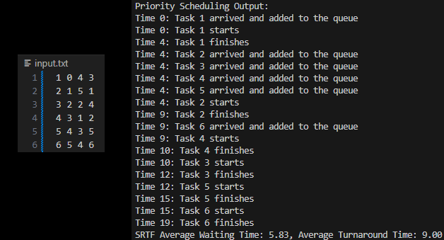
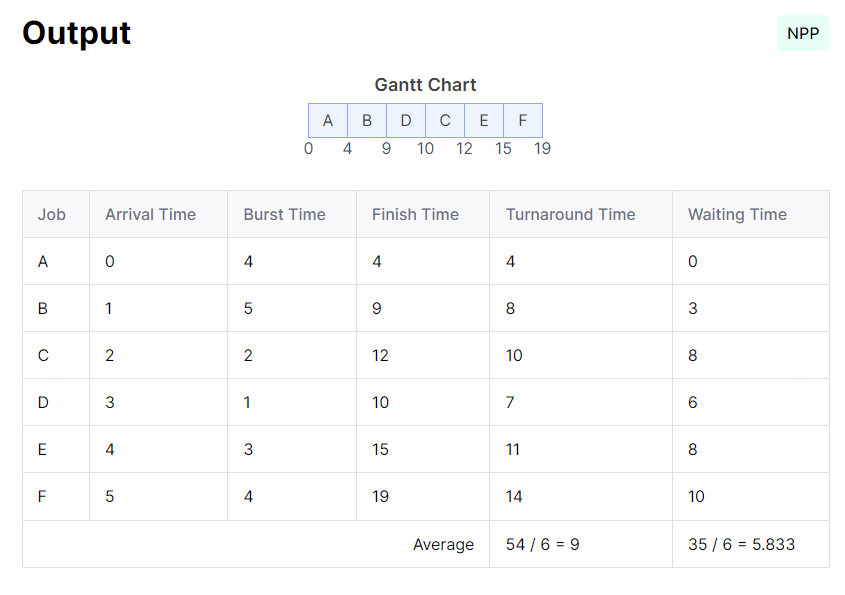

# CPU Scheduling Simulation

This project simulates various CPU scheduling algorithms. These algorithms are critical in operating systems for managing how processes access the CPU. The implemented scheduling methods are:

- Shortest Remaining Time First (SRTF)
- First Come First Serve (FCFS)
- Round Robin (RR)
- Shortest Job First (SJF)
- Shortest Process Next (SPN)
- Non-preemptive Priority Scheduling

## Project Overview

This project allows you to understand and visualize how different CPU scheduling algorithms work. By simulating these algorithms, you can compare their performance based on metrics such as average waiting time and turnaround time.

## Implemented Scheduling Algorithms

### First Come First Serve (FCFS)

FCFS is the simplest scheduling algorithm. In this method, the process that arrives first gets executed first. It operates in a non-preemptive manner.

For more details, visit the [FCFS Documentation](docs/md/FirstComeFirstServe.md).

### Round Robin (RR)

RR scheduling assigns a fixed time unit per process, and cycles through them. It is designed to be fair, giving each process a chance to run.

For more details, visit the [Round Robin Documentation](docs/md/RoundRobin.md).

### Shortest Job First (SJF) & Shortest Process Next (SPN)

SJF, also known as SPN, selects the process with the smallest burst time to execute next. This can be non-preemptive or preemptive.

For more details, visit the [SJF Documentation](docs/md/ShortestJobFirst.md) and the [SPN Documentation](docs/md/ShortestProcessNext.md).

### Shortest Remaining Time First (SRTF)

SRTF is a preemptive version of SJF. It selects the process with the smallest remaining time to execute next.

For more details, visit the [SRTF Documentation](docs/md/ShortestRemainingTimeFirst.md).

### Non-preemptive Priority Scheduling

In this method, each process is assigned a priority. The CPU is allocated to the process with the highest priority (the smallest priority number).

For more details, visit the [Priority Scheduling Documentation](docs/md/Priority.md).

## Tests and Verification

The output of each scheduling algorithm is verified using an external tool for accuracy.

### FCFS Test

#### Output:


#### Verification:


### RR Test

#### Output:


#### Verification:


### SJF & SPN Test

#### Output:


#### Verification:


### SRTF Test

#### Output:


#### Verification:


### Priority Scheduling Test

#### Output:


#### Verification:


## Running the Project

### Prerequisites

- Install Rust from the official [Rust website](https://www.rust-lang.org/tools/install).

### Steps to Run

1. **Compile the Code:**
   ```bash
   rustc main.rs
   ```

2. **Run the Executable:**
   ```bash
   ./main.exe
   ```

## Contributing

If you want to contribute to this project, please fork the repository and submit a pull request with your improvements.
