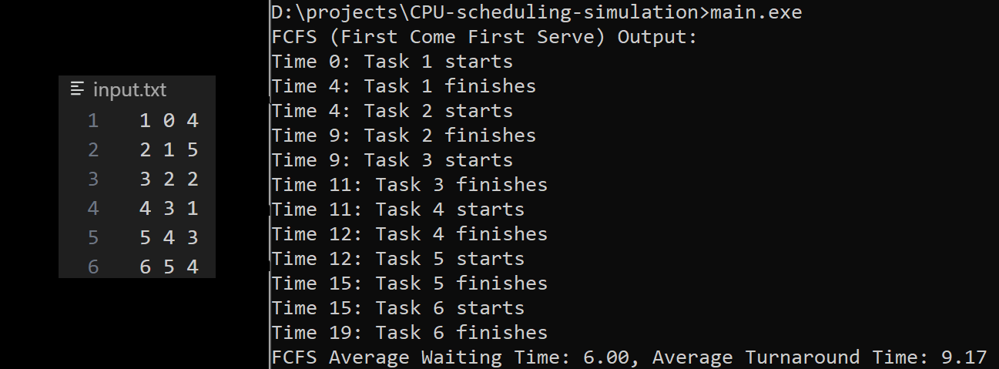
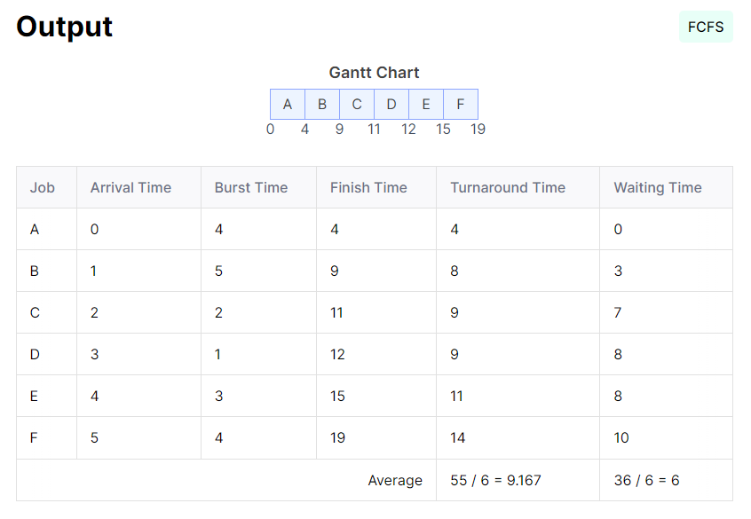
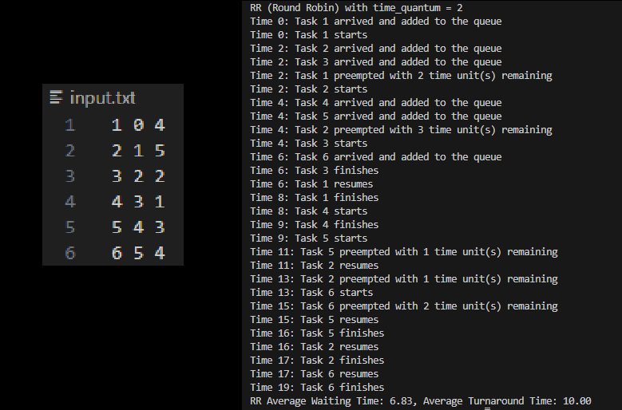
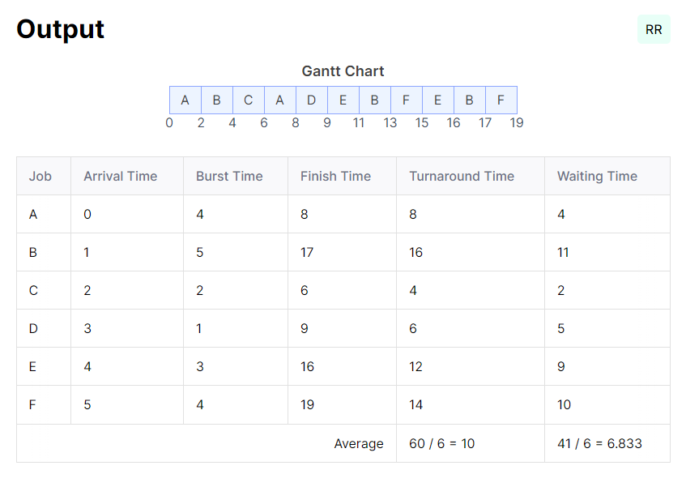
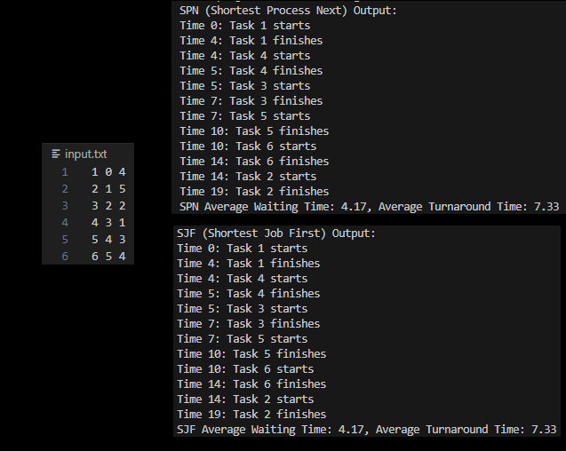
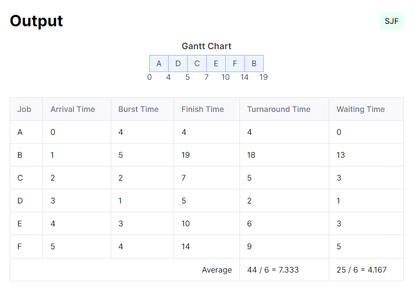
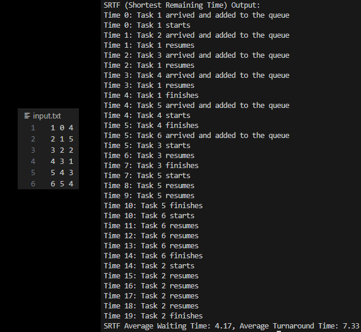
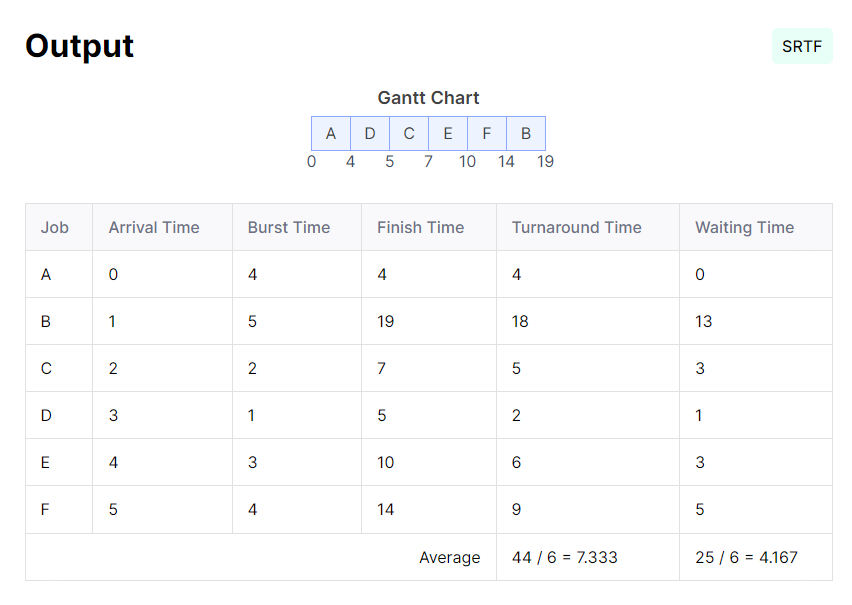

# CPU scheduling simulation
simulate a CPU scheduling system with these methods:
- Shortest Remaining Time First (SRTF) 
- First Come First Serve (FCFS)
- Round-robin_scheduling (RR) 

# more detailed 
## FCFS
[First Come First Serve (FCFS)](docs/md/FirstComeFirstServe.md)

## RR
[Round Robin (RR)](docs/md/RoundRobin.md)

## SJF & SPN
[Shortest Job First (SJF)](docs/md/ShortestJobFirst.md)
[Shortest Process Next (SJF)](docs/md/ShortestProcessNext.md)
# TESTS
## FCFS test
### output:


### verification using an external tool:


## RR test
### output:


### verification using an external tool:


## SJN and SPN test
### output:


### verification using an external tool:


## SRTF test
### output:


### verification using an external tool:

# Run
## install rust
download and install rust from this [link](https://www.rust-lang.org/tools/install)

## run code
```
rustc main.rs
.\main.exe
```


